# QUẢN LÝ CỬA HÀNG LAPTOP

## **THÀNH VIÊN**

- Hoàng Ngọc Dung
- Trần Đặng Minh Quân
- Nguyễn Quốc An 
- Trần Phạm Bảo Long

## **NỘI DUNG**

- [A - BẢNG CHỌN - **NAVIGATION MENU**](#a---bảng-chọn---navigation-menu)
- [B - QUẢN LÝ KHO HÀNG LAPTOP](#b---quản-lý-kho-hàng-laptop)
    - [I - Bảng dữ liệu kho hàng - Table](#i---bảng-dữ-liệu-kho-hàng---table)
        - [1. Table quản lý máy tính](#1-table-quản-lý-kho-hàng-laptop)
        - [2. Table chi tiết máy tính](#2-table-chi-tiết-máy-tính)
        - [3. Table lưu trữ kết quả truy vấn](#3-table-lưu-trữ-kết-quả-truy-vấn)
    - [II - Liên kết kho hàng - Relationship](#ii---liên-kết-kho-hàng---relationship)
         - [1. Liên kết table **Laptop** với table **Specs**](#1-liên-kết-table-laptop-với-table-specs)
    - [III - Truy vấn kho hàng - Query](#iii---truy-vấn-kho-hàng---query)
         - [1. Tìm kiếm Laptop ](#1-tìm-kiếm-laptop)
         - [2. Thêm số lượng sản phẩm đã có sẵn vào kho](#2-thêm-số-lượng-sản-phẩm-đã-có-sẵn-vào-kho)
    - [IV - Biểu mẫu kho hàng - Form](#iv---biểu-mẫu-kho-hàng---form)
        - [1. Form quản lý kho hàng](#1-form-quản-lý-kho-hàng)
        - [2. Form tìm kiếm sản phẩm trong kho](#2-form-tìm-kiếm-sản-phẩm-trong-kho)
            - [a. Form **search** - Nhập thông tin tìm kiếm](#a-form-search---nhập-thông-tin-tìm-kiếm)
            - [b. Form **search_res** - Hiển thị kết quả tìm kiếm](#b-form-search_res---hiển-thị-kết-quả-tìm-kiếm)
- [C - QUẢN LÝ ĐƠN HÀNG](#c---quản-lý-đơn-hàng)
    - [I - Bảng dữ liệu đơn hàng](#i---bảng-dữ-liệu-đơn-hàng)
        - [1. Table **DON_HANG** - Quản lý đơn hàng](#1-table-quản-lý-đơn-hàng)
        - [2. Table **MAT_HANG** - Mặt hàng](#2-table-mặt-hàng)
    - [II - Liên kết đơn hàng - Relationship](#ii---liên-kết-đơn-hàng---relationship)
        - [1. Liên kết table **MAT_HANG** với table **DON_HANG**](#1-liên-kết-mặt-hàng-với-đơn-hàng)
    - [III - Truy vấn - Query](#iii---truy-vấn---query)
        - [1. Tính tổng số lượng trong đơn](#1-tổng-số-lượng-mặt-hàng-trong-đơn)
        - [2. Tính tổng tiền đơn hàng](#2-tính-tổng-tiền-đơn-hàng)
        - [3. Cập nhật số lượng kho](#3-cập-nhật-số-lượng-kho)
    - [IV - Biểu mẫu đơn hàng - Form](#iv---biểu-mẫu-đơn-hàng---form)
        - [1. Menu **DON_HANG** - Quản lý đơn hàng](#1-menu-don_hang---quản-lý-đơn-hàng)
        - [2. Form Danh sách đơn hàng](#2-form-danh-sách-đơn-hàng)
        - [3. Form Hóa đơn bán hàng](#3-form-hóa-đơn-bán-hàng)
        - [4. Form tìm kiếm đơn hàng](#4-form-tìm-kiếm-mặt-hàng)
    - [V - Báo cáo](#v---báo-cáo---report)
        - [1. In hóa đơn](#1-in-hóa-đơn)
- [D - QUẢN LÝ KHÁCH HÀNG](#d---quản-lý-khách-hàng)
    - [I - Bảng dữ liệu khách hàng](#i---bảng-dữ-liệu-khách-hàng)
        - [1. Table **KHACH_HANG** - Quản lý khách hàng](#1-table-khách-hàng)
    - [II - Liên kết quản lý khách hàng - Relationship](#ii---liên-kết-khách-hàng---relationship)
        - [1. Liên kết table **KHACH_HANG** với table **DON_HANG**](#1-liên-kết-table-khach_hang-với-table-don_hang)
    - [III - Biểu mẫu quản lý  khách hàng- Form](#iii---biểu-mẫu-quản-lý-khách-hàng--form)
        - [1. Form **FormKhachHang** - Quản lý khách hàng](#1-form-formkhachhang---quản-lý-khách-hàng)
            - [a. Danh sách khách hàng](#a-danh-sách-khách-hàng)
            - [b. Thông tin khách hàng](#b-thông-tin-khách-hàng)
        - [2. Form **FormThemKhach** - Thêm khách hàng](#2-form-formthemkhach---thêm-khách-hàng)
- [E - NGUỒN THAM KHẢO](#e---nguồn-tham-khảo)

## **A - BẢNG CHỌN - **NAVIGATION MENU****


- Giao diện gồm có 4 nút, khi nhấn vào sẽ thực hiện các chức năng tương ứng:
    + **Kho hàng**: thêm sản phẩm mới hoặc tăng số lượng của sản phẩm đã có sẵn trong kho.
    + **Đơn hàng**: Các chức năng liên quan đến thanh toán và xuất kho.
    + **Tìm kiếm**: tìm các sản phẩm trong kho đáp ứng một số các điều kiện đã được chọn trước đó.
    + **Khách hàng**: Thực hiện một số các chức năng liên quan đến quản lí khách hàng.

- Khởi tạo các nút:
    - Lần lượt tạo các nút `Button` -> Chọn ``Property Sheet``. Chọn `Other` tab -> Thiết lập `Name` : **Kho_hang**, **Don_hang**, **Khach_hang**, **Tim_kiem**.
    - Tiếp theo chọn ``Event`` tab -> ``On click``. Chọn [``Event Procedure``] rồi thiết lập the ``Build button`` (...). Access mở ra code window rồi ta thiết lập như sau.

    ```vb
    Private Sub Kho_hang_Click()
    DoCmd.OpenForm "add" 'mở form
    DoCmd.Close acForm, "menu", acSaveYes 'Close(ObjectType, ObjectName, Save)
    End Sub

    Private Sub Don_hang_Click()
    DoCmd.OpenForm "Menu_DON_HANG"
    DoCmd.Close acForm, "menu", acSaveYes
    End Sub
    ```

    ```vb
    Private Sub Khach_hang_Click()
    DoCmd.OpenForm "FormKhachHang"
    DoCmd.Close acForm, "Menu", acSaveYes
    End Sub

    Private Sub Tim_kiem_Click()
    DoCmd.OpenForm "search"
    DoCmd.Close acForm, "Menu", acSaveYes
    End Sub
    ```

- Từ menu, ta tiến hành chọn các nút  để mở chức năng.

    - Từ menu, chọn nút  để mở chức năng [tìm kiếm](#2-form-tìm-kiếm-sản-phẩm-trong-kho)

    - Từ menu, chọn nút  để mở chức năng [kho hàng](#1-form-quản-lý-kho-hàng)

    - Từ menu, chọn nút  để mở chức năng [khách hàng](#1-form-formkhachhang---quản-lý-khách-hàng)

    - Từ menu, chọn nút  để mở chức năng [đơn hàng](#1-menu-don_hang---quản-lý-đơn-hàng)

## **B - QUẢN LÝ KHO HÀNG LAPTOP**

## I - Bảng dữ liệu kho hàng - Table

### 1. Table quản lý kho hàng laptop

- **Laptop**: là bảng ghi thông tin sơ lược về sản phẩm cũng như giá tiền và số lượng tồn kho. Cụ thể:

    <p align="center">

    |Field Name|Data Type|Description|
    |---|---|--- |
    |STT|AutoNumber|Số thứ tự|
    |ID_LAP|Short Text|Mã kho|
    |Ten|Short Text|Tên dòng sản phẩ
    |Nam ra mat|Date/Time|Ngày/tháng/năm ra mắt|
    |Gia|Currency|Giá|
    |So_luong|Number|Số lượng tồn kho|
    |Nhu_cau|Short Text|Nhu cầu|
    |Rating|Number|Rating|
    |Thuong_hieu|Short Text|Thương hiệu sản phẩm|

    </p>

### 2. Table chi tiết máy tính

- **Specs**: bao gồm thông tin chi tiết về cấu hình của sản phẩm, Gồm trường STT liên kết với trường cùng tên trong table Laptop.

    <p align="center">

    |Field Name|Data Type|Description|
    |---|---|--- |
    |STT|AutoNumber|Số thứ tự|
    |Hang_CPU|Short Text|Hãng CPU|
    |Ten_CPU|Shor tText|Tên dòng CPU|
    |Ma_CPU|Short Text|Mã CPU|
    |Hang_GPU|Short Text|Hãng GPU|
    |Ten_GPU|Short Text|Tên GPU|
    |Xuat_xu|Short Text|Xuất xứ|
    |Kich_thuoc(mm)|Short Text|Kích thước theo format (dài x rộng x cao) theo mm|
    |Khoi_Luong(kg)|Number|Khối lượng|
    |Ram(GB)|Number|Kích thước bộ nhớ RAM theo GB|
    |Man_hinh(inch)|Number|Kích thước màn hình theo inch|
    |Bo_nho_trong(GB)|Number|Kích thước bộ nhớ trong theo GB|
    |Do phan giai|Short Text|Độ phân giải màn hình|
    |O_cung|Short Text|Loại ổ cứng|
    |Loa|Number|Cấu hình loa|
    |Pin(Wh)|Number|Dung lượng pin theo Wh|
    |OS|Short Text|Hệ điều hành|
    </p>

## 3. Table lưu trữ kết quả truy vấn

- **Tmp_filtered**: lưu trữ kết quả trả ra của query `sort` gồm các trường được tổng hợp từ 2 bảng **specs** và **laptop**

## II - Liên kết kho hàng - Relationship

### 1. Liên kết table **Laptop** với table **Specs**

- Nhận thấy mỗi Laptop riêng biệt sẽ bao gồm nhiều chi tiết.

- Trong table **Laptop** ta chọn trường ``STT`` làm primary key (khóa chính) và tham chiếu qua thì ``STT`` table **Specs** là foreign key (khóa ngoại).

- Trên thanh công cụ chọn ``Database Tool`` rồi chọn ``Realtionships`` sau đó tiến hành chọn Table và liên kết (kéo thả).

- Kết quả:

    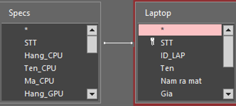

## III - Truy vấn kho hàng - Query

### 1. Tìm kiếm Laptop

### *a) Mô tả*

- Tên query **sort**
- Thuộc loại `make table query`, nhận các giá trị từ form **search**.
- Sau đó tiến hành lọc bảng **laptop** để tìm ra được các sản phẩm phù hợp với tất cả các tiêu chí đã cho, sau đó xuất kết quả ra bảng **tmp_filtere**.

### *b) Cách xây dựng*

- Tạo query kiểu Make Table  .

- Tại mục `Table Name`, đặt tên cho bảng mà query sẽ trả kết quả vào **tmp_filtered**, chọn `OK`.

    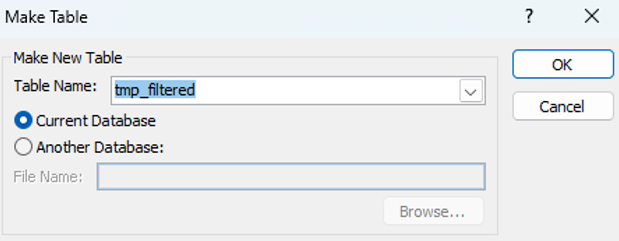

- Thêm các bảng có giá trị cần dùng table **Laptop** và **specs** vào query.

- Thêm điều kiện lọc cho query, xét dữ liệu được truyền vào từ form tìm kiếm, các điều kiện cụ thể cho sản phẩm là:

    - `ID_LAP` phải có xâu con trùng với chuỗi đã nhập trong khung **Tên sản phẩm**. Nếu xâu trong khung là rỗng thì không xét.
    - `Gia` phải nhỏ hơn hoặc bằng giá trị đã nhập vào trong khung **Giá tối đa**. Nếu giá trị trong khung chưa được nhập thì không xét.
    - `Rating` phải lớn hơn hoặc bằng giá trị đã nhập vào trong cột **Rating tối thiểu**. Nếu giá trị trong khung chưa được nhập thì không xét.
    - `Nhu_cau` phải có xâu con trùng với chuỗi đã nhập trong khung **Nhu cầu**. Nếu xâu trong khung là rỗng thì không xét.
    - Các sản phẩm thoả tất cả các điều kiện trên sẽ được sắp xếp tăng dần theo mức giá.

    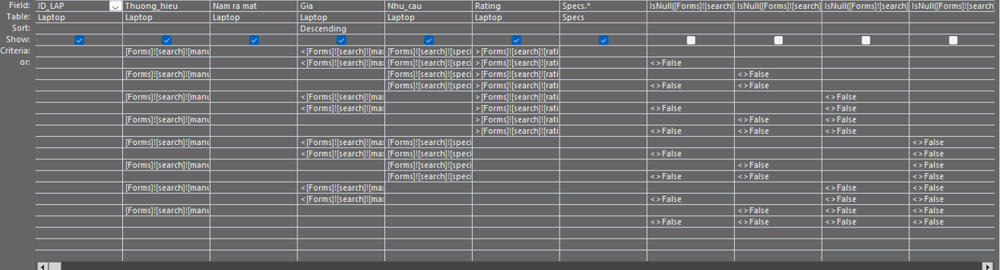

    - Code SQL của query:

    ```vb

    SELECT Laptop.Thuong_hieu, Laptop.Nam ra mat, Laptop.Gia, Laptop.Nhu_cau, Laptop.Rating, Specs.* INTO tmp_filtered
    
    FROM Laptop INNER JOIN Specs ON Laptop.STT = Specs.STT

    WHERE (((Laptop.Thuong_hieu)=[Forms]![search]![manufacture]) AND ((Laptop.Gia)<[Forms]![search]![max_price]) AND ((Laptop.Nhu_cau)=[Forms]![search]![speciality]) AND ((Laptop.Rating)>[Forms]![search]![rating])) OR (((Laptop.Gia)<[Forms]![search]![max_price]) AND ((Laptop.Nhu_cau)=[Forms]![search]![speciality]) AND ((Laptop.Rating)>[Forms]![search]![rating]) AND ((IsNull([Forms]![search]![manufacture]))<>False)) OR (((Laptop.Thuong_hieu)=[Forms]![search]![manufacture]) AND ((Laptop.Nhu_cau)=[Forms]![search]![speciality]) AND ((Laptop.Rating)>[Forms]![search]![rating]) AND ((IsNull([Forms]![search]![max_price]))<>False)) OR (((Laptop.Nhu_cau)=[Forms]![search]![speciality]) AND ((Laptop.Rating)>[Forms]![search]![rating]) AND ((IsNull([Forms]![search]![manufacture]))<>False) AND ((IsNull([Forms]![search]![max_price]))<>False)) OR (((Laptop.Thuong_hieu)=[Forms]![search]![manufacture]) AND ((Laptop.Gia)<[Forms]![search]![max_price]) AND ((Laptop.Rating)>[Forms]![search]![rating]) AND ((IsNull([Forms]![search]![speciality]))<>False)) OR (((Laptop.Gia)<[Forms]![search]![max_price]) AND ((Laptop.Rating)>[Forms]![search]![rating]) AND ((IsNull([Forms]![search]![manufacture]))<>False) AND ((IsNull([Forms]![search]![speciality]))<>False)) OR (((Laptop.Thuong_hieu)=[Forms]![search]![manufacture]) AND ((Laptop.Rating)>[Forms]![search]![rating]) AND ((IsNull([Forms]![search]![max_price]))<>False) AND ((IsNull([Forms]![search]![speciality]))<>False)) OR (((Laptop.Rating)>[Forms]![search]![rating]) AND ((IsNull([Forms]![search]![manufacture]))<>False) AND ((IsNull([Forms]![search]![max_price]))<>False) AND ((IsNull([Forms]![search]![speciality]))<>False)) OR (((Laptop.Thuong_hieu)=[Forms]![search]![manufacture]) AND ((Laptop.Gia)<[Forms]![search]![max_price]) AND ((Laptop.Nhu_cau)=[Forms]![search]![speciality]) AND ((IsNull([Forms]![search]![rating]))<>False)) OR (((Laptop.Gia)<[Forms]![search]![max_price]) AND ((Laptop.Nhu_cau)=[Forms]![search]![speciality]) AND ((IsNull([Forms]![search]![manufacture]))<>False) AND ((IsNull([Forms]![search]![rating]))<>False)) OR (((Laptop.Thuong_hieu)=[Forms]![search]![manufacture]) AND ((Laptop.Nhu_cau)=[Forms]![search]![speciality]) AND ((IsNull([Forms]![search]![max_price]))<>False) AND ((IsNull([Forms]![search]![rating]))<>False)) OR (((Laptop.Nhu_cau)=[Forms]![search]![speciality]) AND ((IsNull([Forms]![search]![manufacture]))<>False) AND ((IsNull([Forms]![search]![max_price]))<>False) AND ((IsNull([Forms]![search]![rating]))<>False)) OR (((Laptop.Thuong_hieu)=[Forms]![search]![manufacture]) AND ((Laptop.Gia)<[Forms]![search]![max_price]) AND ((IsNull([Forms]![search]![speciality]))<>False) AND ((IsNull([Forms]![search]![rating]))<>False)) OR (((Laptop.Gia)<[Forms]![search]![max_price]) AND ((IsNull([Forms]![search]![manufacture]))<>False) AND ((IsNull([Forms]![search]![speciality]))<>False) AND ((IsNull([Forms]![search]![rating]))<>False)) OR (((Laptop.Thuong_hieu)=[Forms]![search]![manufacture]) AND ((IsNull([Forms]![search]![max_price]))<>False) AND ((IsNull([Forms]![search]![speciality]))<>False) AND ((IsNull([Forms]![search]![rating]))<>False)) OR (((IsNull([Forms]![search]![manufacture]))<>False) AND ((IsNull([Forms]![search]![max_price]))<>False) AND ((IsNull([Forms]![search]![speciality]))<>False) AND ((IsNull([Forms]![search]![rating]))<>False))
    ORDER BY Laptop.Gia DESC;

    ```

## 2. Thêm số lượng sản phẩm đã có sẵn vào kho

- `Query_add:` dùng cho việc thêm sản phẩm trong trường hợp sản phẩm đó đã có sẵn trong kho.

- Tạo query design chọn table **Laptop** sau đó thiết lập :

|Field|Table|Update to|Criteria|
|---|---|---|---|
|So_luong|Laptop|[So_luong]+[Forms]![inc]![quan]|
|STT|Laptop||[Forms]![inc]![selected_id]|

- *Lưu ý:*
    - quan : quantity
    - inc : tên form

- Query_add sẽ được dùng để tăng số lượng sản phẩm đã chọn trong chức năng thêm sản phẩm đã có trong kho.

## IV - Biểu mẫu kho hàng - Form

### 1. Form quản lý kho hàng

### *a. Mô tả*

- Giao diện chính của chức năng bao gồm bảng thông tin của kho, cùng với đó là 3 nút lệnh lần lượt tương ứng với 3 chức năng nhập thêm sản phẩm đã có trong kho, nhập sản phẩm mới và trở về menu. Chức năng của từng nút bấm sẽ được hiển thị khi ta di chuột lên trên nút bấm tương ứng.

    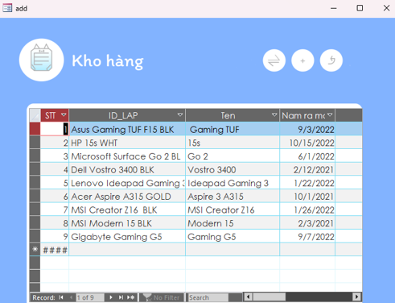

- Form chính **add**: đây là form trung tâm cho chức năng thêm sản phẩm vào kho. Từ đây ta có thể chọn các tuỳ chọn thêm theo ý muốn

- Hai thành phần của chức năng thêm sản phẩm mới vào kho:

    - Form **new01** - Thêm sản phẩm vào kho: ta nhập các thông tin cơ bản của sản phẩm
        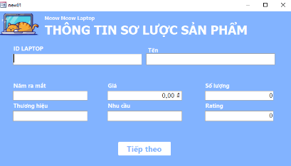

    - Form **new02** - Thêm thông tin chi tiết: Nhập thêm các thông tin chi tiết về cấu hình cũng như các nút lệnh tương ứng để huỷ bỏ hay lưu trữ thông tin vừa nhập.
        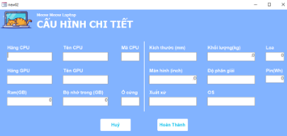

- Form **inc** - Bổ sung số lượng sản phẩm: `form` cho việc thêm các sản phẩm đã có sẵn trong kho. `Form` bao gồm `drop box` để chọn sản phẩm cần thêm và khung để nhập số lượng cần thêm.
    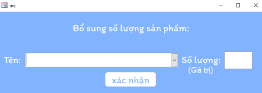

### *b. Hoạt động*

- **Thêm sản phẩm mới:**
    - Bấm vào nút  sau đó lần lượt điền thông tin cần thiết vào bảng thông tin sơ lược, sau đó bấm vào nút .
    - Tiếp tục điền thông tin vào bảng cấu hình chi tiết vừa được mở.
    - Cuối cùng, bấm  để lưu hoặc   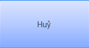 để huỷ bỏ thông tin sản phẩm vừa nhập.
    - **Nhập thêm sản phẩm đã có:**
    - Chọn nút 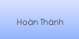. Sau đó sử dụng nút  trên mục **tên sản phẩm** để chọn ra một sản phẩm có trong kho cần được tăng số lượng.
    - Nhập số lượng cần thêm vào ô **số lượng** và bấm

### *c. Cách thức xây dựng*

- Sử dụng chức năng `subform`  để hiển thị thông tin của bảng lưu trữ kho **bảng Laptop** trong `form`.
- Các nút lệnh là các `button` với `tag transparent` mang giá trị yes (làm vô hình các nút lệnh, sau đó được đặt trên `background` có sẵn) 
- Từng nút lệnh sẽ được lập trình để mở và đóng các form tương ứng.
- [Query_add](#2-thêm-số-lượng-sản-phẩm-đã-có-sẵn-vào-kho) sẽ được dùng để tăng số lượng sản phẩm đã chọn trong chức năng thêm sản phẩm đã có trong kho (form **inc**)
- Với 2 form trong chức năng còn lại **new01** và **new02**, ta sử dụng `entry form` để truyền trực tiếp thông tin vào 2 bảng chứa thông tin sơ lược và thông tin chi tiết của máy
    
- Sau khi nhập thành công thông tin vào các bảng. Ta sử dụng câu lệnh **Forms("add")**. `Requery` để tải lại form chứa thông tin vừa cập nhật.

    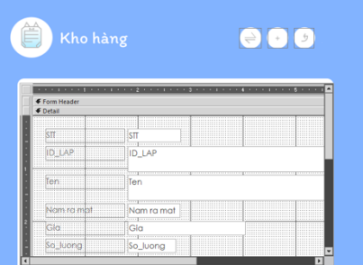

### 2. Form tìm kiếm sản phẩm trong kho

### *a. Form **search** - Nhập thông tin tìm kiếm*

- Form thực hiện chức năng tìm kiếm sản phẩm trong kho. Form gồm các khung để ta có thể nhập các tiêu chí, sau đó là nút lệnh để tìm kiếm sản phẩm trong kho dựa trên các tiêu chí đã đưa ra.

- **Hoạt động**:

    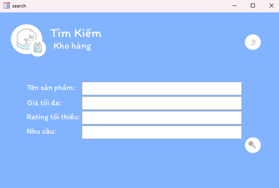

    - Từ giao diện, ta sẽ có 4 khung tương đương với 4 tiêu chí có thể được lọc:
        - **Tên sản phẩm**: có thể dùng để lọc hãng sản xuất, tên dòng máy, hay tìm một loại máy cụ thể.
        - **Giá tối đa**: chỉ hiển thị kết quả là những sản phẩm có mức giá nhỏ hơn hoặc bằng mức giá đã chọn.
        - **Rating tối thiểu**: lọc những sản phẩm có mức đánh giá cao hơn hoặc bằng giá trị đã nhập (mức đánh giá sẽ có giá trị từ 1 đến 5)
        - **Nhu cầu**: lọc ra những sản phẩm với nhu cầu cần tìm (một số gợi ý: gaming, văn phòng, đồ hoạ,…)
    - Sau khi đã nhập những tiêu chí mong muốn, ta bấm vào nút  để tiến hành tìm sản phẩm.
    - Hệ thống sẽ tiến hành thông báo cho ta biết số lượng sản phẩm có trong kho thoả mãn tất cả các tiêu chí
        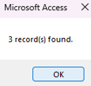.

    - Trong trường hợp tồn tại sản phẩm, ta sẽ được đưa tới form xuất  *dùng để di chuyển qua lại giữa các sản phẩm tìm được*.
    - Nút quay lại form tìm kiếm .
    - *Phần thông tin*: ghi lại đầy đủ thông tin về các sản phẩm tìm được.

- **Cách thức xây dựng**

    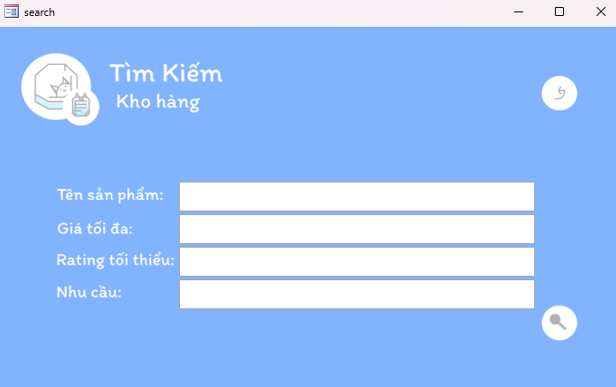

    - Tạo `form` với 3 khung để nhập dữ liệu

    - Tạo các nút chức năng.

    - Tạo [query lọc và table](#1-tìm-kiếm-laptop) lưu kết quả tạm thời.

    - Chạy `form` và ta sẽ thu được các sản phẩm thoả tiêu chí được lưu vào bảng **tmp_filtered**. Ví dụ:

        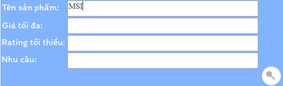
    
    <p align="center">
    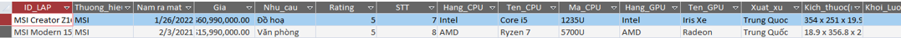
    <br>
    <em>kết quả</em>
    </p>

### *b. Form **search_res** - Hiển thị kết quả tìm kiếm*

- Form được liên kết với bảng “tmp_filtered” để trình bày các thông tin sản phẩm được lọc một cách trực quan.

- **Cách thức xây dựng**

    - Sử dụng `form wizard`tạo một form liên kết với bảng **tmp_filtered**.

    - Thêm các trường hiển thị và nút bấm thích hợp.

        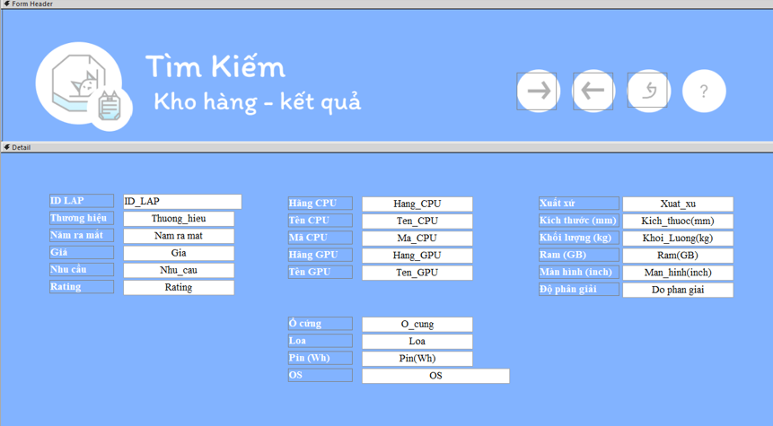

    - Đối với câu lệnh để hiển thị sản phẩm tiếp theo, ta lập trình nút bấm như sau:

        ```vb
        Private Sub B_fwd_Click()
        If Me.CurrentRecord + 1 > Me.Recordset.RecordCount Then
            MsgBox "No next record", vbOKOnly
        Else
            DoCmd.GoToRecord , , acNext
        End If
        End Sub
        ```
        - *Ý nghĩa*: câu lệnh trên sẽ kiểm tra xem có sản phẩm sau sản phẩm đang hiển thị không. Nếu có sẽ nhảy sang sản phẩm kế tiếp.
    - Đối với câu lệnh lùi về, ta làm ngược lại.

## **C - QUẢN LÝ ĐƠN HÀNG**

## I - Bảng dữ liệu đơn hàng 

### 1. Table Quản lý đơn hàng

<p align="center">

|Field Name|Data Type|Description|
|---|---|--- |
|ID_DON|AutoNumber|Mã đơn hàng|
|NDH|Date/Time|Ngày đặt hàng|
|NGH|Calculated|Ngày giao hàng dự kiến|
|Ten_Kh|Short Text|Tên Khách hàng|
|ID_KH|Short Text|ID khách hàng|
|Tong_so_luong|Number| Tổng số lượng mặt hàng|
|Giao_hang|Yes/No|Tình trạng giao hàng|
|Chi_phi_phu|Currency|Chi phí phụ (chi phí giao hàng)|
|Tong tien|Currency|Tổng số tiền tạm tính|
|Searchitem|Calulated|[Sử dụng cho việc tìm kiếm](#4-form-tìm-kiếm-mặt-hàng)

</p>

**Một số thiết lập liên quan**

>|NDH| Ngày đặt hàng |
>|---|---|
>| Format |  dd/mm/yyyy hh:nn am/pm   |
>| Default Value| =Now()|
<br>

>|NGH| Ngày giao hàng|
>|---|---|
>|Expression|[NDH]+Abs(3*[GIAO_HANG])|
>|Result Type|Date/Time|
>| Format |  dd/mm/yyyy hh:nn am/pm   |
<br>

>|ID_KH| Mã khách hàng|
>|---|---|
>|Display Control|`Combo Box`|
>|Row Source Type|Table\Query|
>|Row Source |SELECT [KHACH_HANG].[ID], [KHACH_HANG].[Name], [KHACH_HANG].[PhoneNumber], [KHACH_HANG].[Email] FROM KHACH_HANG; |

### 2. Table Mặt hàng

<p align="center">

Field Name|Data Type|Description|
|---|---|--- |
|ID_DON|Number|Mã đơn|
|IDM|AutoNumber|số ID mặt hàng của đơn|
|ID_LAP|Number|Mã laptop|
|Gia_tien|Number|Giá tiền mỗi mặt hàng|
|So_luong|Number|Số lượng|

</p>

**Một số thiết lập liên quan**

#### `ID_LAP` : dữ liệu được lấy từ trường `ID_LAP` và được liên kết với `STT` của table `LAPTOP`.

Lookup||
|---|---|
|`Dislap Control`|Combo Box|
|`Row Source Type`|Table/Query|
|`Row Source`|SELECT Laptop.STT, Laptop.ID_LAP FROM Laptop|

```sql
SELECT Laptop.STT, Laptop.ID_LAP 
FROM Laptop; 
```

#### `Gia_tien` : dữ liệu được lấy từ trường `Gia` và được liên kết với `ID_LAP` của table `LAPTOP`.

|General||
|---|---|
|`Format`|Currency

Lookup||
|---|---|
|`Dislap Control`|Combo Box|
|`Row Source Type`|Table/Query|
|`Row Source`|SELECT Laptop.Gia, Laptop.ID_LAP FROM Laptop; |

```sql
SELECT Laptop.Gia, Laptop.ID_LAP FROM Laptop; 
```

> `SELECT` được sử dụng để chọn dữ liệu từ cơ sở dữ liệu. Dữ liệu trả về được lưu trữ trong một bảng kết quả.

## II - Liên kết đơn hàng  - Relationship

### 1. Liên kết mặt hàng với đơn hàng

- Nhận thấy mỗi đơn hàng riêng biệt sẽ bao gồm nhiều mặt hàng khác nhau 
và cả hai bảng đều chung trường `ID_DON`.

- Trong table **DON_HANG** ta chọn trường ``ID_DON`` làm primary key (khóa chính) và tham chiếu qua thì ``ID_DON`` table **MAT_HANG** là foreign key (khóa ngoại).

- Trên thanh công cụ chọn ``Database Tool`` rồi chọn ``Realtionships`` sau đó tiến hành chọn Table và liên kết (kéo thả).

    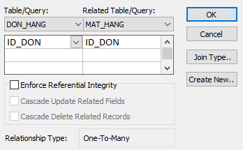

- Kết quả:

    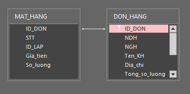

## III - Truy vấn - Query

### 1. Tổng số lượng mặt hàng trong đơn

>Việc tính tổng số lượng mặt hàng trong một đơn hàng rồi cập nhất. Em tạo các Truy vấn hành động (``Action Query``) để thực hiện.

**Bước 1**: Tạo Table tạm để tính tổng số lượng mặt hàng của từng ``ID_DON``.

```sql
SELECT ID_DON, Sum(So_luong) AS TONG INTO DUNG
FROM MAT_HANG
GROUP BY ID_DON;
```

- Dùng Hàm ``Sum(So_luong)`` để tính tổng số lượng mặt hàng của đơn.

- Sau đó gán tổng vừa tính cho trường mới ``TONG`` của table mới ``DUNG``.

- ``GROUP BY``: nhóm các ID_DON trong table **MAT_HANG**.

<p align="center">
        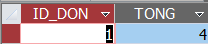
        <br>
            <em>Kết quả</em>
        </p>


Cú pháp

```sql
SELECT fieldlist
FROM table
WHERE criteria
[GROUP BY groupfieldlist]
```

Phần|Mô tả|
|---|---|
|`fieldlist`|Tên của một hoặc nhiều trường cần truy xuất cùng |
|`table`|Tên của bảng mà các bản ghi được truy xuất từ đó.|
|`criteria`|Tiêu chí lựa chọn. Nếu câu lệnh có mệnh đề WHERE, thì bộ máy cơ sở dữ liệu Microsoft Access sẽ nhóm các giá trị sau khi áp dụng điều kiện WHERE cho các bản ghi.|
|`groupfieldlist`|Tên của tối đa 10 trường được dùng để nhóm các bản ghi.|

**Bước 2**: truy xuất ``Tong_so_luong`` trong table **DUNG** tương ứng với ``ID_DON`` trong table **DON_HANG**.

```sql
UPDATE DON_HANG AS A INNER JOIN DUNG ON A.ID_DON = DUNG.ID_DON SET A.Tong_so_luong = DUNG.TONG;
```

- Để thuận tiện em gọi ``A`` là **DON_HANG**.

- ``INNER JOIN``: trả về kết quả khi có một sự phù hợp trong tất cả các bảng được ``join``

    

- Trong đó bảng **A** là bảng trái từ khóa ``INNER JOIN``, **DUNG** là bảng phải. Biểu thức sau từ khóa ``ON`` cụ thể ``A.ID_DON = DUNG.ID_DON`` là biểu thức khớp nối.

- ``UPDATE`` trường ``TONG`` của bảng **DUNG** cho``Tong_so_luong`` của Bảng **A**.

**Bước 3**: Xóa table tạm

```sql
DROP TABLE DUNG
```

### 2. Tính tổng tiền đơn hàng

>Việc tính tổng số tiền trong một đơn hàng rồi cập nhất. Em tạo các Truy vấn hành động (``Action Query``) để thực hiện.

**Bước 1**: Tạo Table tạm để tính tổng tiền của tất cả mặt hàng trong từng ``ID_DON``.

```sql
SELECT ID_DON, Sum(Gia_tien * So_luong) AS Sum_Money INTO TMP_MONEY
FROM MAT_HANG
GROUP BY ID_DON;
```

- Dùng Hàm ``Sum(Gia_tien * So_luong)`` để tính tổng tiền của tất cả mặt hàng trong của đơn.

- Sau đó gán tổng vừa tính cho trường mới ``Sum_Money`` của table mới ``TMP_MONEY``.

- ``GROUP BY``: nhóm các ID_DON trong table **MAT_HANG**.

    <p align="center">
        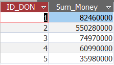
        <br>
            <em>Kết quả</em>
        </p>

**Bước 2**: truy xuất ``Sum_MONEY`` trong table **TMP_MONEY** tương ứng với ``ID_DON`` trong table **DON_HANG**.

```sql
UPDATE DON_HANG AS A INNER JOIN TMP_MONEY ON A.ID_DON = TMP_MONEY.ID_DON SET A.Tong_tien = TMP_MONEY.SUM_MONEY + A.Chi_phi_phu;
```

- Để thuận tiện em gọi ``A`` là **DON_HANG**.

- Trong đó bảng **A** là bảng trái từ khóa ``INNER JOIN``, **TMP_MONEY** là bảng phải. Biểu thức sau từ khóa ``ON`` cụ thể ``A.ID_DON = TMP_MONEY.ID_DON`` là biểu thức khớp nối.

- ``UPDATE`` trường ``SUM_MONEY`` của bảng **TMP_MONEY** + trường ``Chi_phi_phu`` của bảng **A** cho``Tong_tien`` của Bảng **A**.

**Bước 3**: Xóa table tạm

```sql
DROP TABLE TMP_MONEY
```

### 3. Cập nhật số lượng kho

>Sau khách hàng đã mua một số mặt hàng x. Ta cần dùng query update để cập nhật lại kho hàng.

**Bước 1**: Chọn ``Query Design``

**Bước 2**: Trong ``Query Type`` chọn ``Update``

**Bước 3**: Thiết lập `` So_luong`` trong table **Laptop** trừ ``So_luong`` trong table **MAT_HANG**

Field|Table|Update to|
|---|---|---|
|So_luong|Laptop|`[Laptop]![So_luong]-[MAT_HANG]![So_luong]`|

### 4. Cập nhật dữ liệu khách hàng cho đơn hàng - **UPDATE_NAME_KH**

- Chọn ``Query Design`` -> `SQL View` rồi nhập

```sql
UPDATE KHACH_HANG INNER JOIN DON_HANG ON KHACH_HANG.ID = DON_HANG.ID_KH SET DON_HANG.Ten_KH = [KHACH_HANG]![Name];
```

## IV - Biểu mẫu đơn hàng - Form

### 1. **Menu DON_HANG** - Quản lý đơn hàng

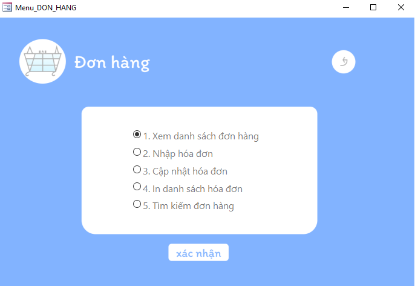

### *a. Mô tả*

- Menu đơn hàng sẽ bao gồm các tùy chọn như sau:

    - [Xem danh sách đơn hàng](#2-form-danh-sách-đơn-hàng)
    - [Nhập hóa đơn](#3-form-hóa-đơn-bán-hàng)
    - [Cập nhật hóa đơn](#3-form-hóa-đơn-bán-hàng)
    - [In danh sách hóa đơn](#1-in-hóa-đơn)
    - [Tìm kiếm đơn hàng](#4-form-tìm-kiếm-mặt-hàng)

- Chọn vào ô muốn đến rồi nhấn **xác nhận**

### *b. Cách thức xây dựng*

- Tạo `form desgin` rồi tạo `Option Group` đặt tên là **lựa chọn** rồi tuần tự nhập `Label Name` và `Option Value` sẽ tự động thiết lập từ 1 -> 5.Sau đó nhấn `Finish`

- Tạo nút `button` thiết lập name `qldh_thuchien`. Trong `Envent` chọn `[Embedded Macro]`. Sử dụng câu lệnh `if` để thực hiện:

    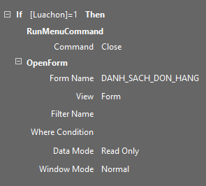 <br> <br> Xem danh sách đơn hàng: ta chọn `Openform`

    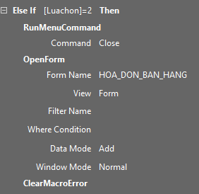 <br> <br>Nhập hóa đơn: ta chọn `Openform` nhưng trong `Data Mode` chọn `Add`.

    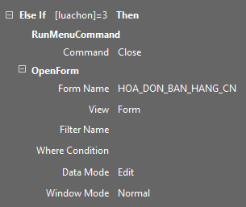 <br> <br> Cập nhật hóa đơn: ta chọn `Openform` nhưng trong `Data Mode` chọn `Add`.

    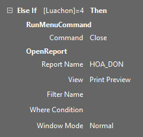 <br> <br>In danh sách hóa đơn: ta chọn `Open Report`<br> nhưng trong `View chọn `Print Preview`.

    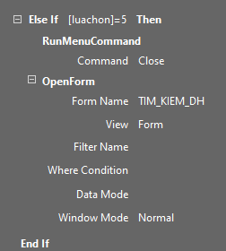 <br> <br> Tìm kiếm đơn hàng: ta chọn `Open form`.

- Tạo nút `button` thiết lập name `thoat` rồi trong Envent` chọn `[Event Procedure]`. Sau đó thiết lập như sau:

    ```vb
    Private Sub Thoat_Click()
    DoCmd.OpenForm "Menu" 'mở form menu
    DoCmd.Close acForm, "Menu_DON_HANG", acSaveYes 'đóng form menu đơn hàng
    End Sub
    ```

### 2. Form Danh sách đơn hàng

- **Mô tả:** Form dùng để xem danh sách đơn hàng và không có quyền chỉnh sửa:

- **Cách xây dựng**: 
- Trong `Create` chọn `navigation` sau đó chọn `Harizontal Tab`.

    - Ta tiến hành tạo form **DON_HANG_DS** - danh sách đơn hàng bằng `form Wizard` rồi chọn các trường cần thiết: `ID_DON`, `Ngày đặt hang`, `Ngày giao hàng`, `Tên khách hàng`, `Địa chỉ giao hàng`, `Chi phí phụ`, `Tổng số lượng`, `Tổng tiền`.
    Trong `default view` : `Continuous Forms`.

    - Ta thiết lập Form **MAT_HANG_DS** - danh sách mặt hàng bằng `form Wizard` rồi chọn các trường cần thiết. Trong `default view` : `Continuous Forms`.

    - Ta thực hiện kéo thả form **DON_HANG_DS** và **MAT_HANG_DS** vào ô `Add` 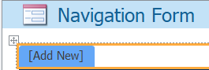

        <p align="center">
        
        <br>
            <em>Hình ảnh Form danh sách đơn hàng</em>
        </p>

        <p align="center">
        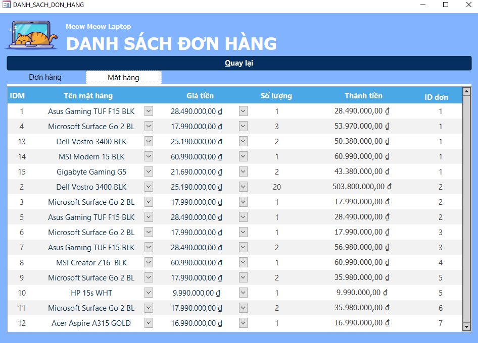
        <br>
            <em>Hình ảnh Form danh sách mặt hàng</em>
        </p>

    <br>

    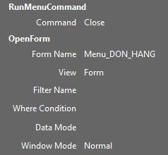 - Cuối cùng thêm nút `button` thiết lập `name`: *quay lại* rồi trong `Envent` chọn `[Event Macro]`. Sau đó thiết lập như sau:

### 3. Form Hóa đơn bán hàng

### *a. Cập nhật hóa đơn*

<p align="center">
  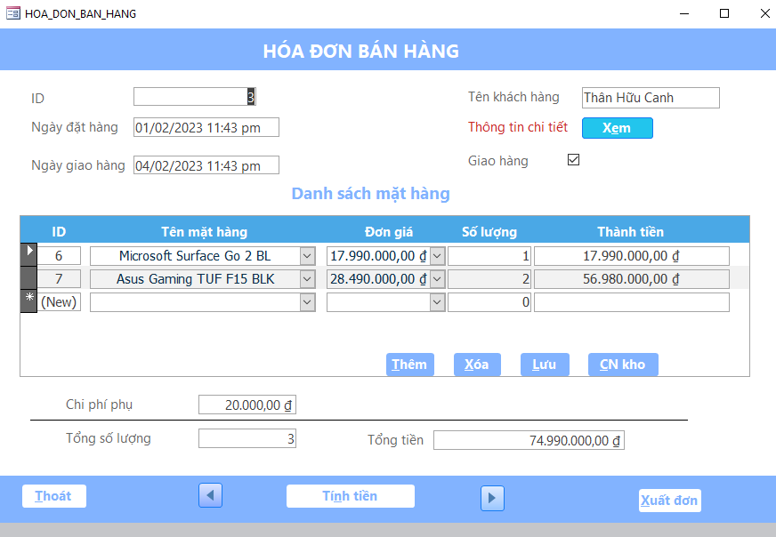
  <br>
    <em>Hình ảnh Form cập nhập hóa đơn</em>
</p>


- **Mô tả:** form dùng để thực hiện việc nhập , cập nhật , xuất đơn hàng.

- **Lưu ý:** Trong dữ liệu của trường *đơn giá* - **Danh sách mặt hàng** ta cần chứ ý tới cột cuối cùng (` số lượng mặt hàng hiện có trong kho `)  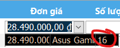 để lựa chọn số lượng khi bán hàng cho phù hợp.

- **Cách xây dựng:**

    - Chọn **Form Design** -> chọn **Add Existing Field**. Tiến hành thêm các trường như: `ID_DON`, `Ngày đặt hang`, `Ngày giao hàng`, `Tên khách hàng`, `Chi phí phụ`, `Tổng số lượng`, `Tổng tiền`.

    - Label `Thông tin chi tiết` được liên kết tới [Form khác hàng](#1-form-formkhachhang---quản-lý-khách-hàng)

    - Chọn **Subform** sau đó thiết lập form **MAT_HANG_subform**.

    - Thiết lập Các `Button` cuả form **HOA_DON_BAN_HANG**:

        + **`Button 1`**: Chọn ``Property Sheet`` -> ``Event`` tab -> ``On click``. Chọn [`Embedded Macro`] rồi thiết lập ``Build button`` (...). Sau đó add `CloseWindown`. Trong `Format` tab -> nhập `Caption`: *&Thoát*.

        + **`Button 2`**: Chọn ``Property Sheet`` -> ``Event`` tab -> ``On click``. Trong `Format` tab -> nhập `Caption`:*Tí&nh tiền*. Sau đó chọn [``Event Procedure``] rồi thiết lập the ``Build button`` (...). Access mở ra code window rồi ta thiết lập như sau.

            ```vb
            Private Sub Tinhtien_Click()
                DoCmd.OpenQuery "Create_TmpTSL_Table"
                DoCmd.OpenQuery "UPDATE_TSL"
                DoCmd.OpenQuery "DROP_TABLE_D"
                DoCmd.OpenQuery "Create_tmpMoney_table"
                DoCmd.OpenQuery "UPDATE_MONEY"
                DoCmd.OpenQuery "DROP_TMP_MONEY"
            End Sub
            ```

            > Ta sử dụng các `query` được thiết lập ở mục [[III]](#iii---truy-vấn---query). Theo thứ tự `Create` -> `Update` -> `Drop`.

        + **`Button 3`**: Chọn ``Property Sheet`` -> ``Event`` tab -> ``On click``. Trong `Format` tab -> nhập `Caption`:*Xuất đơn*. Sau đó ta kết hợp với [báo cáo](#v---báo-cáo---report).

    - Thiết lập Các `Button` cuả subform **MAT_HANG** ta sử dụng `marco` + `use control wizard`:

        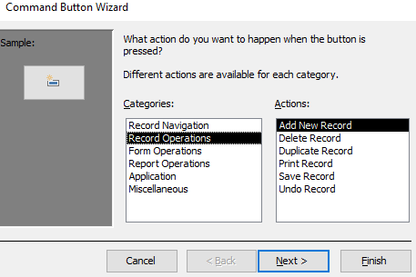

        - Chọn `Record Operations` -> `Add New Record`. Sau đó nhấn `Next` -> Thiết lập text `&Them`. Nhấn `Finish` để kết thúc.
        - Tương tự ta thiết lập `Delete Record` và `Save Record`.
        - Ta đã thiết lập query [Cập nhật số lượng kho](#3-cập-nhật-số-lượng-kho) nên ta chọn `Miscellanecous` -> `Run Query` -> **UPDATE_SL_LAPTOP**. Sau đó nhấn `Next` -> Thiết lập text `&CN Kho`. Nhấn `Finish` để kết thúc.

            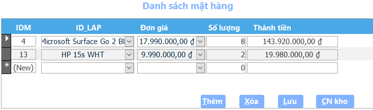

        - **Lưu ý:** Để tránh trường hợp bán quá số lượng đang có ta thiết lập trong đơn giá thêm cột số lượng.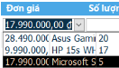
            - Trong `Data` ->  `Row Source` :

                ```sql
                SELECT Laptop.Gia, Laptop.ID_LAP, Laptop.So_luong FROM Laptop;
                ```
### *b. Nhập hóa đơn*

<p align="center">
  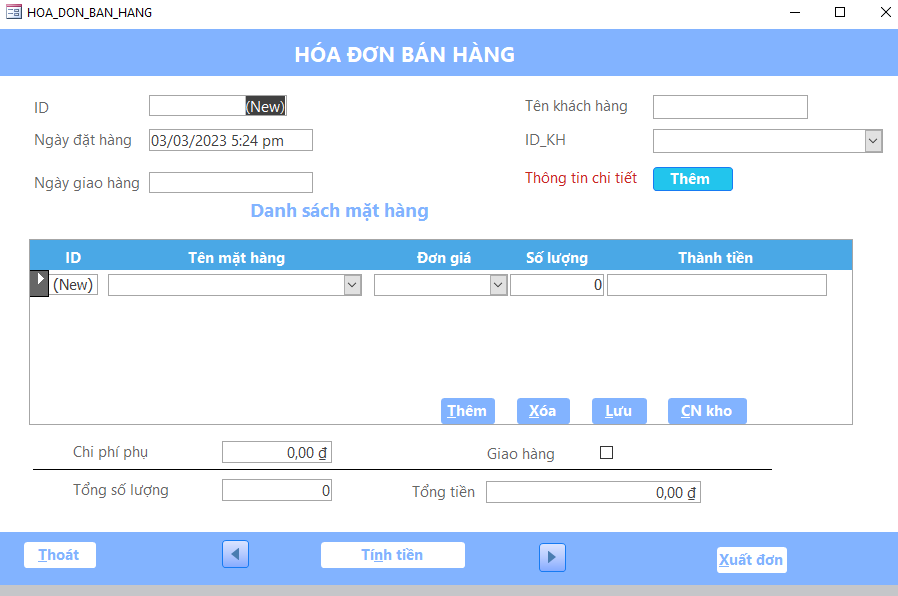
  <br>
    <em>Hình ảnh Form cập nhập hóa đơn</em>
</p>

- **Mô tả:** form dùng để thực hiện việc nhập đơn hàng, xuất đơn hàng và liên kết với [form thêm khác hàng](#2-form-formthemkhach---thêm-khách-hàng).

- **Cách xây dựng:** tương tự như [form cập nhật hóa đơn](#a-cập-nhật-hóa-đơn)

### 4. Form tìm kiếm mặt hàng

### *a.Mô tả*

<p align="center">
    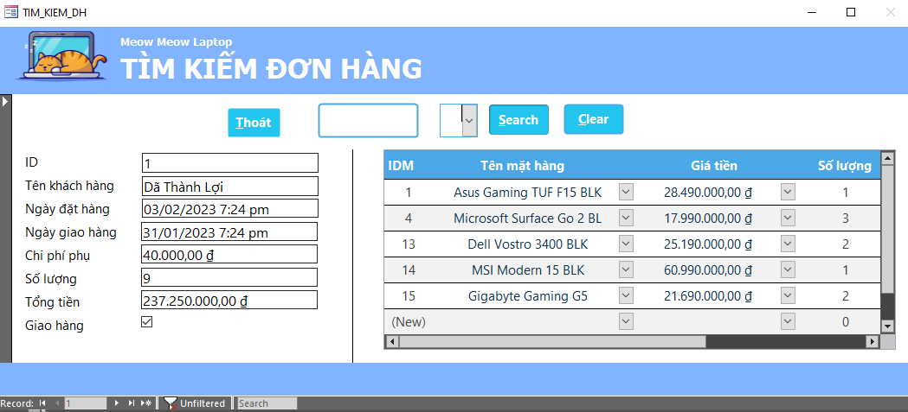
    <br>
        <em>Hình ảnh form tìm kiếm </em>
    </p>

### *b. Cách xây dựng*

> Ta sẽ thực hiện tìm kiếm theo `ID_DON` và  `Tên khách hàng, địa chỉ, Ngày giao hàng, ngày đặt hàng.`

- Kết quả sẽ hiện thị thông tin đơn hàng và chi tiết các mặt hàng của đơn (sử dung `subform`)

- Tạo nút tìm kiếm ta làm như sau :
    - Mở **TIM_KIEM_DON_HANG** in design view
    - Tạo nút `Button` -> Chọn ``Property Sheet``. Chọn `Other` tab -> Thiết lập `Name` : SearchF.
    - Tạo hai `text box` lần lượt đặt tên là `FIND` và `Search_ID`
    - Mở table **DON_HANG** thêm trường `Searchitem` kiểu dữ liệu `Calculated`. Trong `General` -> Experssion : [Ten_KH] & [NDH] & [NGH] & [Dia_chi]
    - Tiếp theo chọn ``Event`` tab -> ``On click``. Chọn [``Event Procedure``] rồi thiết lập the ``Build button`` (...). Access mở ra code window rồi ta thiết lập như sau.

    ```vb
    Private Sub SearchF_Click()
    Me.FIND.SetFocus
    Me.Search_ID.SetFocus
    Me.FilterOn = False
    Me.Filter = "[DON_HANG]![Searchitem]Like'*" & FIND & "*'"
    Me.Filter = Me.Filter & " And [DON_HANG]![ID_DON]Like'*" & Search_ID & "*'"
    Me.FilterOn = True
    Me.Requery
    End Sub
    ```
    - Sử dụng `Me.filter` để lọc các thông tin thuộc `Searchitem` khi nhập vào `FIND`./..
    - Để lọc theo nhiều tiêu chí ta suử dụng toán tử `&`.
    - Sử dụng `SetFocus` để ta hướng thông tin đến đối tượng `FIND` và `Search_ID`

- Tạo nút Clear data sau khi tìm kiếm ta làm như sau :

    - Tạo nút `Button` -> Chọn ``Property Sheet``. Chọn `Other` tab -> Thiết lập `Name` : ClearF.
    - Tiếp theo chọn ``Event`` tab -> ``On click``. Chọn [``Event Procedure``] rồi thiết lập the ``Build button`` (...). Access mở ra code window rồi ta thiết lập như sau.

    ```vb
    Private Sub ClearF_Click()
    DoCmd.ShowAllRecords
    Me.FIND.SetFocus
    Me.Search_ID.SetFocus
    Me.FIND = ""
    Me. Search_ID = ""
    End Sub
    ```
    - Cập nhật `Find` và `Search_ID` thành rỗng

- Tao nút thoát

    - Tạo `button` trong `Format` tab -> nhập `Caption`: *&Thoát*.
    - Chọn ``Property Sheet`` -> ``Event`` tab -> ``On click``. Chọn [`Embedded Procedure`] rồi thiết lập`.

    ```vb
    Private Sub Thoát_Click()
    DoCmd.OpenForm "Menu_DON_HANG"
    DoCmd.Close acForm, "TIM_KIEM_DH", acSaveYes
    End Sub
    ```
- Tạo nút `button` tiến, lùi:
    - Chọn `Record Operations` -> `Go to Next Record`. Sau đó nhấn `Next` -> Thiết lập text `&Them`. Nhấn `Finish` để kết thúc.
    - Chọn `Record Operations` -> `Add Previous Record`. Sau đó nhấn `Next` -> Thiết lập text `&Them`. Nhấn `Finish` để kết thúc.

## V - Báo cáo - Report

### 1. In hóa đơn

> Sau khi nhập hóa đơn ta sẽ tiến hành xuất hóa đơn.

<p align="center">
    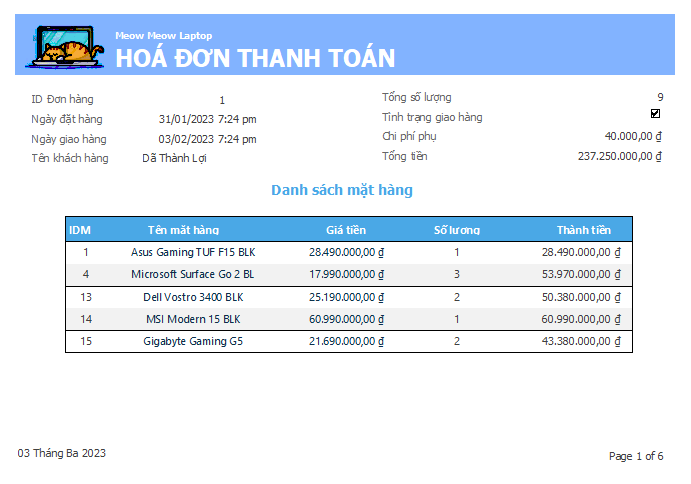
    <br>
        <em>Hình ảnh báo cáo ID đơn hàng 1  </em>
    </p>

**Bước 1**: Sử dụng `Report Design` để tạo report ``HOA_DON``

**Bước 2**: Trong **form HOA_DON_BAN_HANG** tạo ``Button`` làm nút xuất đơn. Nút này sẽ dẫn đến report **HOA_DON**.

**Bước 3**: Mở **form HOA_DON_BAN_HANG** in design view. Chọn ``Property Sheet`` -> ``Event`` tab -> ``On click``. Chọn [``Event Procedure``] rồi thiết lập the ``Build button`` (...). Access mở ra code window rồi ta thiết lập như sau.

```vb
Private Sub Xuat_hoa_don_Click()
    Dim strWhere As String
    If Me.Dirty Then
        Me.Dirty = False
    End If

    If Me.NewRecord Then
        MsgBox "Select a record to print"
    Else
        strWhere = "[ID_DON] = " & Me.[ID_DON]
        DoCmd.Minimize
        DoCmd.OpenReport "HOA_DON", acViewPreview, , strWhere
    End If
End Sub
```

**Chú thích**

- Nếu khóa chính là kiểu ``Text`` thì:

```vb
strWhere = "[ID_DON] = """ & Me.[ID_DON] & """"
```

- Sử dụng thuộc tính `Dirty` để xác định xem bản ghi hiện tại đã được sửa đổi hay chưa kể từ lần lưu cuối.

    + `True`: Bản ghi hiện tại đã được thay đổi.

    + `False`: Bản ghi hiện tại chưa được thay đổi.

- Vì vậy, khi một bản ghi được lưu ta đặt thuộc tính `Dirty` thành `False`. Khi người dùng tạo các thay đổi đối với một bản ghi, ta đặt thành `True`.

- Sử dụng thuộc tính `NewRecord` để xác định xem bản ghi hiện tại có phải là bản ghi mới hay không. 

- ``DoCmd.OpenReport`` thực hiện hành động `OpenReport` trong `Visual Basic`.

- Khi in hóa đơn ta có thể sử dụng `acViewPreview` để xem trước khi in. Nếu không muốn xem trước thì ta sử dụng `acViewNormal`

## **D - QUẢN LÝ KHÁCH HÀNG**

## I - Bảng dữ liệu khách hàng

### 1. Table khách hàng

<p align="center">

|Field Name|Data Type|Description|
|---|---|--- |
|Short Text|ID|ID khách hàng|
|Short Text|Name|Tên khách hàng|
|Short Text|Gender|Giới tính|
|Date/Time|Birthdate|Ngày sinh|
|Short Text|PhoneNumber|Số điện thoại|
|Short Text|Email|Địa chỉ email|
|Long Text|Address|Địa chỉ cư trú|

</p>

**Một số thiết lập liên quan**

>|ID| ID khách hàng |
>|---|---|
>| `Default Value`|"CS" & Int((9999999 - 1000000 + 1) * Rnd() + 1000000)|
</p>

## II - Liên kết khách hàng - Relationship

### 1. Liên kết table **KHACH_HANG** với table **DON_HANG**

- Nhận thấy mỗi khách hàng sẽ mua nhiều đơn hàng khác nhau.

- Trong table **KHACH_HANG** ta chọn trường ``ID`` làm primary key (khóa chính) và tham chiếu qua thì `ID_KH` table **DON_HANG** là foreign key (khóa ngoại).
    > Cả hai trường đều giống nhau về dữ liệu và kiểu dữ liệu.

- Trên thanh công cụ chọn ``Database Tool`` rồi chọn ``Realtionships`` sau đó tiến hành chọn Table và liên kết (kéo thả).

    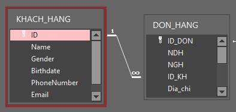

- Kết quả:

    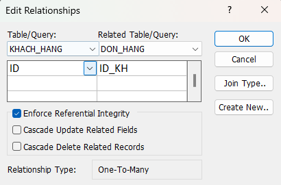

## III - Biểu mẫu quản lý  khách hàng- Form

### 1. Form **FormKhachHang** - Quản lý khách hàng

<p align="center">
  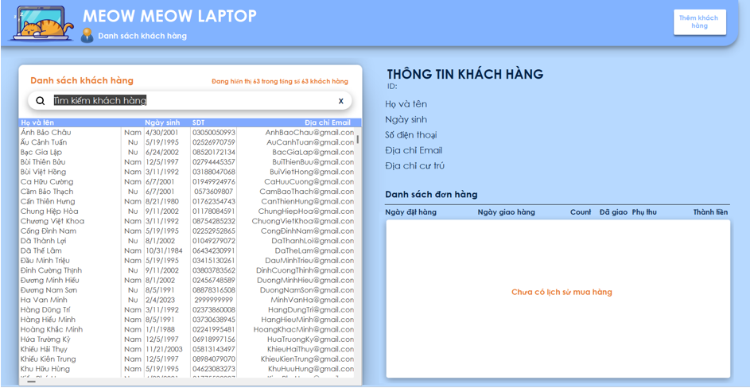
  <br>
    <em>Hình ảnh Form khách hàng</em>
</p>

### *a. Danh sách khách hàng*

- Tạo một `ListBox` tên *UserList* có `attribute` (thuộc tính) `RowSource` (là SQL quản lý data của `ListBox` dưới kiểu dữ liệu của xâu kí tự **[String]**) là một SQL như sau:

    ```sql
    SELECT ID, Name, Gender, Birthdate, PhoneNumber, Email, Address 
    FROM  KHACH_HANG                                                     
    ORDER BY Name
    ```
- *Ý nghĩa*: Lấy các trường *Name*, *Gender*, *Birthdate*, *PhoneNumber*, *Email*, *Gender*, *Address* từ bảng **KHACH_HANG** và sắp xếp (tăng dần [A -> z]) theo *Name*.

    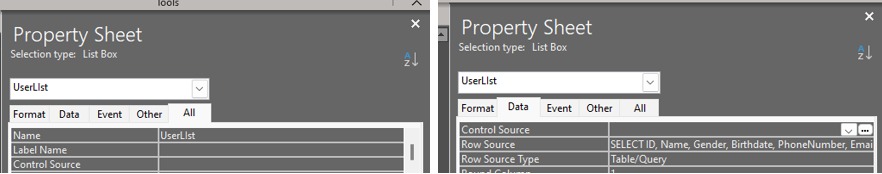

- Khi đấy `ListBox` sẽ có kết quả như sau:

    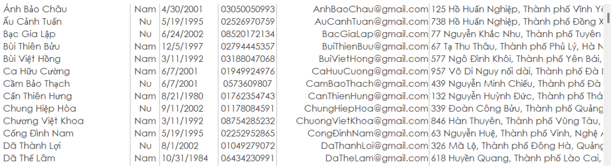

    - Với các cột có dât theo thứ tự giống với SQL là: `ID* - Name – Gender – Birthdate – PhoneNumber – Email – Address` (Cột ID đã bị giấu đi)

    - Format lại, ta được:

    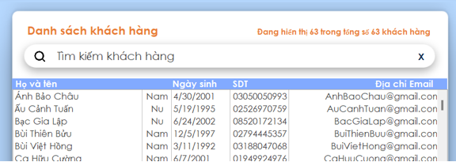

- Để thuận tiện cho việc tìm kiếm khách hàng khi danh sách khách hàng quá dài, một hệ thống tìm kiếm khách hàng theo tên được thêm vào.

- Khi người dùng nhập tên vào hộp thoại tìm kiếm khách hàng, danh sách sẽ tự động cập nhật để chỉ hiển thị những khách hàng có tên bao gồm các kí tự được nhập trong hộp thoại. **Để thực hiện được điều đó**:

    - Tạo một `TextBox` có tên là **UserSearch**
    
    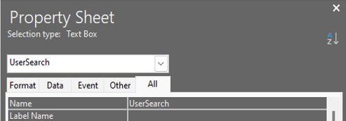 
    
    - Để bảng được cập nhật (`update`) mỗi khi người dùng nhập vào một giá trị mới, ta sử dụng `event On Change` trong `tab event` của `TextBox`.
    - `Even On Change` sẽ được chạy mỗi khi có một sự thay đổi đến nó, trong đó có cả việc thêm vào hay xóa bớt các kí tự trong `InputBox`.

- **SQL Tìm kiếm khách hàng theo tên**:

    ```sql
    SELECT ID, Name, Gender, Birthdate, PhoneNumber, Email, Address 
    FROM KHACH_HANG                                                                
    WHERE Name Like '*qry*'                                        
    ORDER BY Name
    ```
    - Ý nghĩa: Lấy các trường *Name, Gender, Birthdate, PhoneNumber, Email, Gender, Address* từ bảng **KHACH_HANG** có `Name` bao Gồm `qry` (Tên cần tìm) trong nó. Sắp xếp (tăng dần [A->z]) theo `Name`.

- Tạo một `Function` (Hàm) tên là **HandleUserChange**, mỗi khi người dùng nhập kí tự mới vào, `function` **HandleUserChange** sẽ chạy và gán SQL mới cho **UserList**, từ đó cập nhật và thay đổi data trong danh sách.

```vb
    Public Function HandleUserChange()
        Dim sql As String 'Khởi tạo biến SQL
        Dim qry As String 'Khởi tạo biến dữ liệu nhập

        'Kiểm tra xem nếu giá trị của TextBox rỗng
        If (IsNull(Me.UserSearch)) Then
            qry = ""
        Else
            qry = Me.UserSearch 'Nếu không rỗng, ta gán giá trị vào qry
        End If
        
        'Code SQL Tìm kiếm khách hàng dưới dạng String
        sql = "SELECT ID, Name, Gender, Birthdate, PhoneNumber, Email, Address FROM KHACH_HANG WHERE Name Like '*" & qry & "*' ORDER BY Name"
        'Gán lại SQL cho RowSource của UserList
        Me.UserLIst.RowSource = sql
        UpdateCounter
    End Function
    'Event On Change của TextBox
    Private Sub UserSearch_Change()
        HandleUserChange
    End Sub
```

### *b. Thông tin khách hàng*

- **Thông tin chi tiết**

    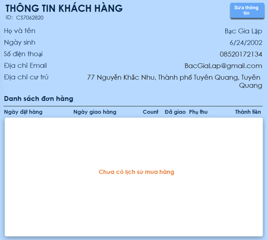

    - Đầu tiên, tạo các TextBox cho các danh mục: *Họ và tên, ngày sinh, số điện thoại, địa chỉ email, địa chỉ cư trú*. Đặt tên cho từng `TextBox` lần lượt là: *CurName, CurBirthdate, CurPhoneNumber, CurEmail, CurAddress*.

    - Mỗi khi người dùng ấn vào một khách hàng bên phía danh sách khách hàng thì thông tin bên bảng chi tiết sẽ được cập nhật tương ứng:

    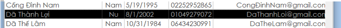
    
    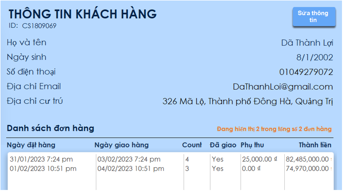

    - Để thực hiện được điều đó:
		- *Bước 1*: Lấy khách hàng được chọn ở danh sách khách hàng
			
        - *Bước 2*: Chỉnh giá trị của các `TextBox` với các thông tin tương ứng.
		
	- **Bước 1**: Lấy khách hàng được chọn ở danh sách khách hàng.
        - `ListBox` lưu trữ data khách hàng được chọn bằng một danh sách, để lấy phần tử đầu tiên trong các danh sách được chọn:

            ```vb
            Dim varItem
            varItem = Me.UserList.ItemsSelected(0)
            ```
            
		- Lúc này,**varItem** sẽ là số chỉ tới hàng đầu tiên được chọn.
        - Với số thứ tự của hàng, ta sẽ lấy các giá trị tương ứng bằng:

            ```vb
            Dim ID, Name, Birthdate, PhoneNumber, Email, Address

            ‘[Giá trị] = Me.UserList.Column([cột], varItem)

            ID = Me.UserLIst.Column(0, varItem)
            Name = Me.UserLIst.Column(1, varItem)
            Birthdate = Me.UserLIst.Column(3, varItem)
            PhoneNumber = Me.UserLIst.Column(4, varItem)
            Email = Me.UserLIst.Column(5, varItem)
            Address = Me.UserLIst.Column(6, varItem)
            ```
    - **Bước 2**: Chỉnh giá trị của các `TextBox` với thông tin tương ứng
        - Từ đó, ta thay đổi giá trị của các `TextBox` với các giá trị tương ứng:
        
            ```vb
            Me.CurID.Value = ID
            Me.CurName.Value = Name
            Me.CurBirthdate.Value = Birthdate
            Me.CurPhoneNumber.Value = PhoneNumber
            Me.CurEmail.Value = Email
            Me.CurAddress.Value = Address
            ```

- **Thông tin đơn hàng**

    - Tạo một `ListBox` để hiển thị các đơn hàng của khách hàng, đặt tên là `OrderList`.

    - SQL Tìm kiếm đơn hàng theo tên:

    ```vb
    SELECT ID_DON, NDH, NGH, ID_KH, Tong_so_luong, Giao_hang, Chi_phi_phu, Tong_tien
    FROM DON_HANG
    WHERE ID_KH Like '*ID*'
    ORDER BY NDH
    ```

    - *Ý nghĩa*:

    ```md
    Lấy các trường ID_DON, NDH, NGH, ID_KH, Tong_so_luong, Giao_hang, Chi_phi_phu, Tong_tien
    Từ bảng DON_HANG
    Có KH_ID Bao Gồm ID (ID khách hàng) trong nó.                                                    
    Sắp xếp (giảm dần [mới -> cũ]) theo NDH
    ```

    - Như bảng khách hàng, ta cập nhật bằng cách gán lại `RowSource` của `OrderList` với xâu SQL mới

    ```sql
    Dim sql As String
    sql = "SELECT ID_DON, NDH, NGH, ID_KH, Tong_so_luong, Giao_hang, Chi_phi_phu, Tong_tien FROM DON_HANG WHERE ID_KH Like '*" & ID & "*' ORDER BY NDH"
    Me.OrderList.RowSource = sql
    ```

### 2. Form **FormThemKhach** - Thêm khách hàng

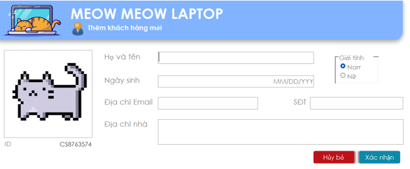

- Đầu tiên, tạo các TextBox cho các danh mục: *Họ và tên, ngày sinh, số điện thoại, địa chỉ email, địa chỉ cư trú*. Đặt tên cho từng `TextBox` lần lượt là: `NewID, NewName, NewEmail, NewBirthdate, NewPhoneNumber, NewEmail, NewAddress`.

- Tiếp tục tạo một `OptionGroup` cho giới tính với hai giá trị là Nam và Nữ, đặt tên là *NewGender*.

- Lấy giá trị của từng `TextBox và OptionGroup`

    ```vb
    Dim Passed, ID, Name, Email, PhoneNumber, Address, Gender, GenderVal

    ID = Me.NewID.Value
    Name = Me.NewName.Value
    Birthdate = Me.NewBirthdate.Value
    Email = Me.NewEmail.Value
    PhoneNumber = Me.NewSDT.Value
    Address = Me.NewAddress.Value
    GenderVal = Me.NewGender.Value
    ```
- Đối với giới tính, vì value (Me.NewGender.Value) là một số, ta lấy giá trị mới bằng cách:

    ```vb 
    Gender = "Nu"
    If (GenderVal = 1) Then Gender = "Nam"
    ```
- Sau đó sử dụng SQL để Insert vô bảng:
    ```vb
    Col = "INSERT INTO Khach_Hang (ID, Name, Gender, Birthdate, PhoneNumber, Email, Address) "
    Val = "VALUES ('" & ID & "', '" & Name & "', '" & Gender & "','" & Birthdate & "','" & PhoneNumber & "', '" & Email & "', '" & Address & "')"
    DoCmd.RunSQL (Col + Val)
    ```

## **E - NGUỒN THAM KHẢO**

[VBA](https://learn.microsoft.com/en-us/office/vba/api/access)

[stackoverflow](https://stackoverflow.com/)

[SQL](https://www.tutorialspoint.com/ms_access/ms_access_sql_view.htm)
